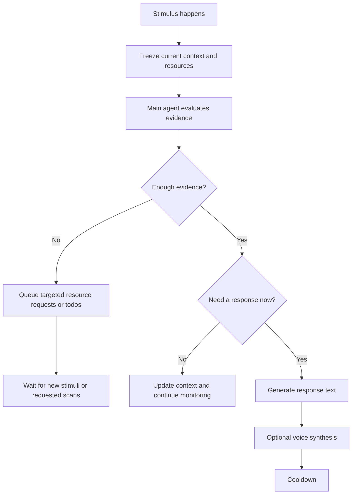
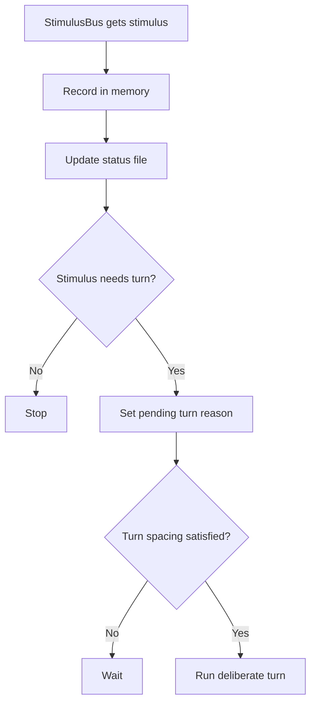
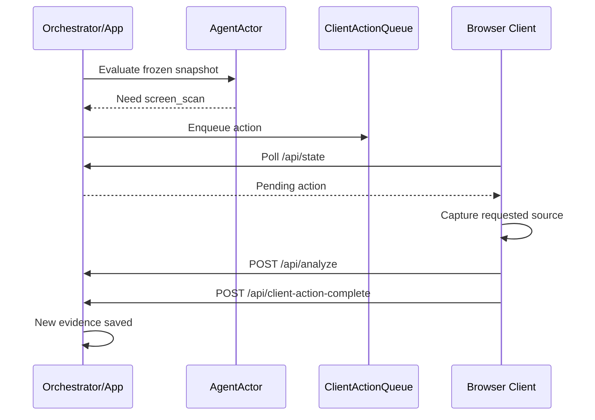
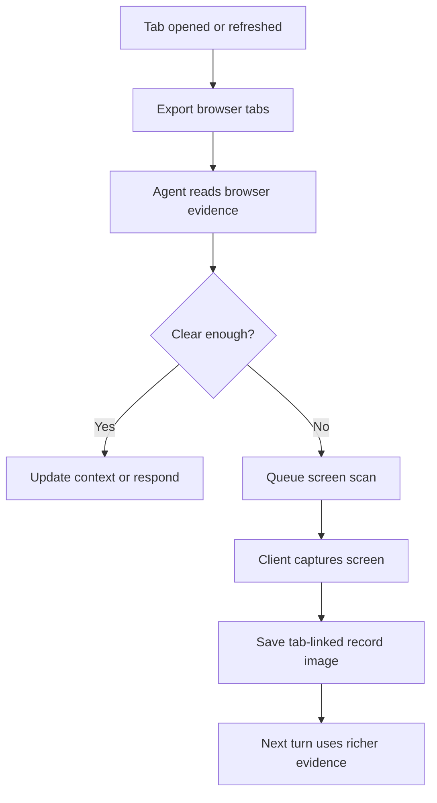
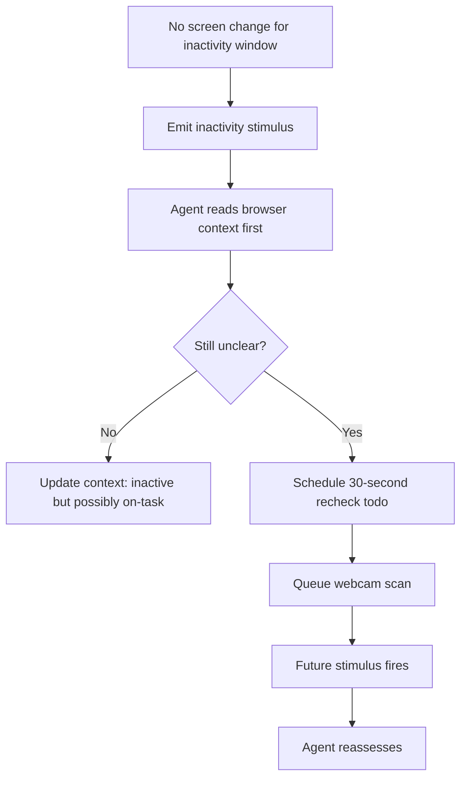
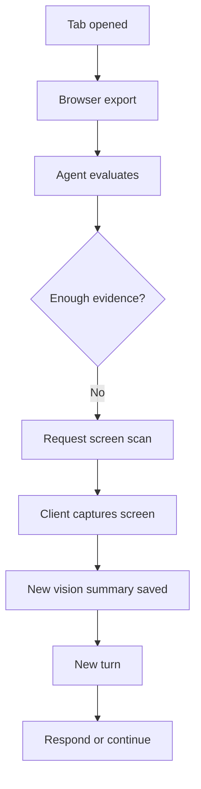
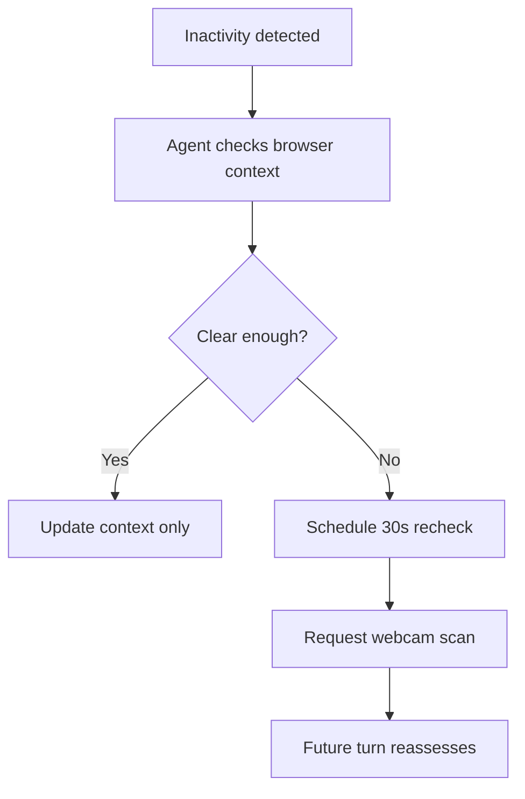
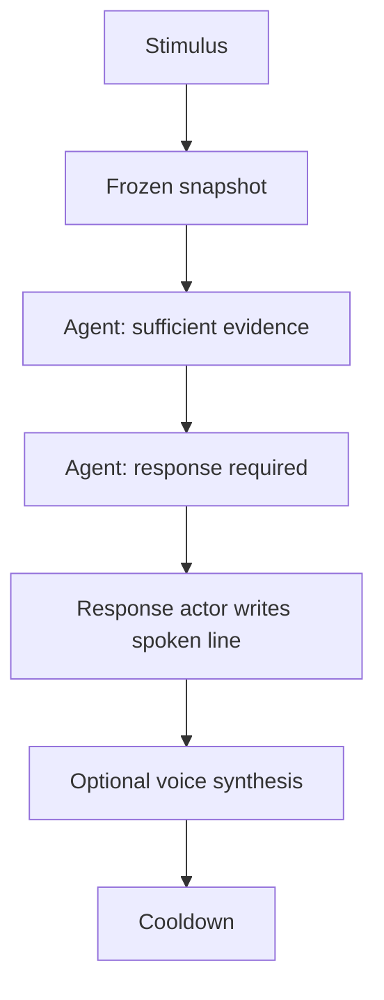

# Big Brother Agent Runtime Explained

This file explains how the agent works right now in plain language.

It is written for someone who wants to understand:

- what starts a turn
- what the agent reads
- what the agent decides
- how extra scans get requested
- how todos and context files work
- how a spoken response is produced

It also includes step-by-step trace examples and simple flowcharts.

---

## 1. Big Picture

The system is now closer to a real agent than a fixed pipeline.

Instead of doing the same model calls every cycle, it works like this:

1. Something changes.
2. A `stimulus` is created.
3. The server freezes the current evidence into a snapshot.
4. The main agent asks: "Do I already know enough?"
5. If no:
   it requests more specific resources, like a screen scan or webcam scan.
6. If yes:
   it decides whether the user needs a response.
7. If a response is needed:
   the response actor turns that into a short spoken line.

So the core loop is:

---

## 2. Main Parts

## Server-side parts

- `app.py`
  The main application. It owns state, receives API calls, runs agent turns, and stores outputs.

- `orchestrator.py`
  The event loop. It watches for stimuli and decides when to run a deliberate turn.

- `actors.py`
  Contains the LLM-driven decision makers:
  - `AgentActor`: the main reasoning agent
  - `PersonalityActor`: the final speaking/response actor

- `agent_core.py`
  Holds persistent agent primitives:
  - token ledger
  - memory log
  - status file
  - todo list
  - context files
  - client action queue
  - stimulus bus

- `resources.py`
  Loads the latest webcam, screen, and browser resource text that the agent reads.

- `browser_live_demo.py`
  Reads tabs from the tracked browser and writes browser summaries and per-tab records.

## Client-side parts

- `webapp/app.js`
  Captures webcam and screen frames, detects change cheaply, uploads scans, and executes server-requested client actions.

---

## 3. The Agent's Mental Model

The system keeps several kinds of memory, and they each do a different job.

## A. Status file

This is the current "quick status" of the agent.

It stores things like:

- current focus state
- last stimulus type
- last turn reason
- last turn time
- notes

Think of it as the agent's dashboard summary.

## B. Memory log

This is an append-only event log.

It stores things like:

- stimuli received
- observations saved
- client actions completed
- agent turn summaries

Think of it as the running diary.

## C. Context files

These are the most agent-like part of the system.

There are two:

- current context
- historic context

The current context stores the latest known short summary of what is going on.

The historic context stores recent snapshots over time.

Think of them like:

- current context = "what is true right now"
- historic context = "what has been happening lately"

## D. Todo list

The agent can schedule future work for itself.

Examples:

- "Re-check inactivity in 30 seconds"
- "Ask for webcam scan in 30 seconds"

When a todo becomes due, it becomes a new `todo_due` stimulus.

## E. Client action queue

This is how the server asks the browser client to do targeted work.

Examples:

- take a screen scan
- take a webcam scan
- mark a browser-only request as completed

This is important because the server cannot directly capture the user's webcam or screen. The browser client has to do that part.

---

## 4. What Counts as a Stimulus

A stimulus is anything that should make the agent reconsider the situation.

Current stimulus types include:

- `tab_opened`
- `tab_closed`
- `tab_refreshed`
- `capture_updated`
- `inactivity`
- `activity`
- `todo_due`
- `heartbeat`
- `manual`
- `frame_unchanged`

## Special cases

- `frame_unchanged`
  This is a freshness signal only. It usually does not need a full agent turn.

- `heartbeat`
  This makes sure the system still checks in occasionally even if nothing has happened for a while.

---

## 5. How a Turn Starts

The orchestrator is always listening for stimuli.

When it receives one:

1. it records the stimulus in memory
2. it updates the status file
3. it decides whether a turn should run
4. it rate-limits turns so bursts collapse into one deliberate turn

This prevents the system from panicking and running the agent many times at once.

Here is the turn-start flow:

---

## 6. What Happens Inside a Deliberate Turn

Every deliberate turn follows the same structure.

## Step 1. Freeze the snapshot

The system collects a frozen copy of:

- current goal
- browser export
- latest browser text
- latest webcam summary
- latest screenshare summary
- last stimulus
- resource revision

This matters because the agent should reason about one stable view of the world, not a moving target.

## Step 2. Skip if evidence is unchanged

The app computes a fingerprint from:

- the goal
- the combined resource prompt text

If the evidence is the same as the last turn, the agent call is skipped.

That means:

- fewer model calls
- fewer tokens
- no fake re-reasoning on identical evidence

## Step 3. Ask the main agent

The `AgentActor` gets:

- the session goal
- the stimulus type
- the frozen resources
- the current context
- recent historic context

It returns a plan containing:

- whether the evidence is sufficient
- the current focus state
- a short summary
- evidence lines
- whether a response is required
- the response text, if needed
- requested resources, if needed
- todos to schedule
- notes

## Step 4. Apply the plan

If the plan asks for more resources:

- queue client actions like `screen_scan` or `webcam_scan`
- add todos if future re-checks are needed

If the plan says a response is required:

- call the response actor
- generate spoken text
- optionally synthesize voice audio

## Step 5. Save what happened

After the turn, the app updates:

- status file
- memory log
- current context
- historic context
- UI state

---

## 7. How the Main Agent Thinks

The main agent is not just saying "off task" or "on task".

It is trying to answer two questions:

1. Do I already have enough evidence?
2. If yes, what should I do next?

That means it can behave in three broad ways:

## Mode 1. Enough evidence, no response needed

Example:

- browser shows a study page
- screen looks like notes or homework
- no signs of distraction

Result:

- update context
- do nothing else

## Mode 2. Not enough evidence yet

Example:

- a tab opened
- browser logs are not clear enough
- the page could be study-related or distracting

Result:

- request a targeted screen scan
- maybe request browser context
- wait for the new evidence

## Mode 3. Enough evidence, response needed

Example:

- resources clearly show something unrelated to the goal
- current context suggests drift away from the task

Result:

- generate a response
- optionally speak it
- enter cooldown

---

## 8. How Resource Requests Work

The agent cannot capture images directly. It can only request them.

So there is a split:

- server decides what it needs
- browser client performs the actual capture

## Resource request types

The agent can queue actions like:

- `screen_scan`
- `webcam_scan`
- `browser_rag`

## What happens next

1. The action is added to the client action queue.
2. The browser UI sees pending actions in `/api/state`.
3. The browser executes the action if possible.
4. The browser uploads the result.
5. The browser marks the action complete.
6. The new upload creates fresh stimuli and a future turn can use the result.

Flow:

---

## 9. Tab Change Priority Logic

Your requested tab-change priorities are now represented like this:

1. Browser change happens.
2. Browser tabs are exported first.
3. The agent reads the browser text first because it is cheap.
4. If the situation is still ambiguous, the agent can request a screen scan.
5. A tab-linked screen record can be saved for that tab.
6. Per-tab records are kept while the tab exists.
7. If the tab closes, stale tab record files are removed.

Simple view:

## Important note

"RAG of tab" is only partially present right now.

What exists now:

- browser tab export
- browser summary
- per-tab JSON records
- optional page text extraction through browser debugging

What does not fully exist yet:

- a separate retrieval engine that indexes and ranks past tab documents in a deep RAG pipeline

So the current system has tab context records and browser text, but not a full retrieval subsystem yet.

---

## 10. Inactivity Priority Logic

Your inactivity priority notes map to the current design like this:

1. Client detects inactivity from unchanged screen frames.
2. It emits an `inactivity` stimulus.
3. The agent does not immediately assume distraction.
4. It first uses browser context because the user may be:
   - watching a relevant video
   - reading something useful
   - paused on a meaningful screen
5. If more checking is needed, the agent can:
   - schedule a re-check todo in 30 seconds
   - request a webcam scan

Flow:

This is much closer to the desired behavior than the older "unchanged screen means maybe off-task" style.

---

## 11. How Screen and Webcam Scanning Are Controlled

The client tries to avoid expensive uploads.

## Cheap first

Before uploading a real frame, the client computes a tiny grayscale signature.

It uses that to decide if the frame changed enough to matter.

## Current rules

- screen scans:
  auto-upload only when changed

- webcam scans:
  slower cadence, unless stronger motion is detected

- unchanged frames:
  do not upload full images
  send a lightweight freshness stimulus instead

This keeps the system responsive without paying for vision analysis every cycle.

---

## 12. How the Response Actor Works

The response actor does not decide whether intervention is needed.

The main agent decides that first.

If the main agent says a response is required, the response actor:

1. reads the goal
2. reads the agent's summary and evidence
3. turns that into one short spoken line

So the response actor is mainly a delivery layer.

Its job is:

- short
- clear
- natural out loud
- grounded in evidence

---

## 13. Cooldown

After a spoken response is produced, the app can enter cooldown.

Cooldown means:

- do not immediately generate another response
- allow time for the user to react
- keep resources updating, but avoid repeated nagging

This makes the system feel less twitchy and less repetitive.

---

## 14. Files the Agent Reads and Writes

## Inputs it reads

- webcam summary text
- screenshare summary text
- browser export text
- browser summary JSON
- per-tab record JSON files
- current context file
- recent historic context
- status file
- todo list

## Outputs it writes

- updated status file
- memory log entries
- context current snapshot
- context history entry
- client action queue entries
- todo items
- optional per-tab record images
- optional spoken audio file

---

## 15. Trace Example: Tab Opens to an Ambiguous Site

Imagine the user opens a new tab.

The tab title and URL alone do not make it obvious whether this helps the study goal.

## Step-by-step trace

1. Browser debugging sees the new tab.
2. Orchestrator emits `tab_opened`.
3. App freezes a turn snapshot.
4. Browser export is included in the snapshot.
5. Agent reads:
   - goal
   - stimulus
   - browser export
   - current context
   - recent history
6. Agent decides:
   "Not enough evidence yet."
7. Agent queues:
   - a `screen_scan`
   - maybe browser context follow-up
8. Client sees the pending action.
9. Client captures the screen.
10. Vision summary is saved.
11. `capture_updated` stimulus fires.
12. A later turn now has richer evidence.
13. Agent either:
   - updates context quietly, or
   - produces a response if the tab is clearly distracting

Mini flow:

---

## 16. Trace Example: User Goes Inactive

Imagine the screen does not change for a while.

## Step-by-step trace

1. Client notices no screen change for the inactivity window.
2. Client sends `inactivity`.
3. Orchestrator records the stimulus.
4. App freezes a snapshot.
5. Agent reads browser evidence first.
6. Agent decides one of two things:

### Branch A: enough evidence already

Example:

- browser shows a lecture video or useful reading

Result:

- context updated to something like
  "User is inactive but may still be on-task"
- no spoken response

### Branch B: still unclear

Result:

- add todo: re-check in 30 seconds
- request webcam scan
- wait for the next evidence update

Mini flow:

---

## 17. Trace Example: Clear Distraction

Imagine the current evidence is already strong:

- browser shows unrelated entertainment
- screen confirms it
- context suggests this is not helping the study goal

## Step-by-step trace

1. Stimulus starts a turn.
2. Snapshot is frozen.
3. Agent says:
   - evidence is sufficient
   - focus state is distracted
   - response is required
4. Response actor turns that into a short spoken line.
5. Audio may be synthesized.
6. Cooldown starts.
7. Context and history are updated.

Mini flow:

---

## 18. What Is Better Than the Old System

The older design was still shaped like:

- watcher
- threshold
- escalate later

The new runtime is more agent-like because it can:

- reason about whether evidence is sufficient
- request the next best resource
- schedule future checks
- maintain current and historic context
- use different priorities for different stimuli

The key shift is:

old system:
always evaluate the same evidence path

new system:
choose the next best action based on what just happened

---

## 19. What Still Is Not Fully Built Yet

The system is more agentic now, but there are still some unfinished areas.

## Not fully complete yet

- full tab RAG / retrieval system
- richer condition-based todos
  right now todos are mostly time-based
- deeper planning across many steps
  right now the agent plans one turn ahead quite well, but it is not yet a long-horizon planner
- UI wording cleanup
  some labels still use old watcher/MPA language in places
- verification script refresh
  the old verification file still reflects the earlier watcher-threshold architecture

---

## 20. Short Summary

If you want the shortest accurate explanation, it is this:

The app now runs as a stimulus-driven agent.

Each turn, it freezes the current evidence, reads current and recent context, decides whether that evidence is sufficient, requests targeted new scans or follow-up todos if needed, and only generates a response when it has enough grounded evidence to do so.

That is the most important change.
